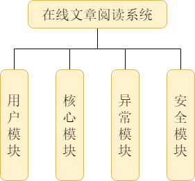
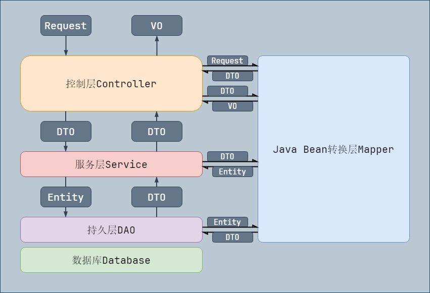
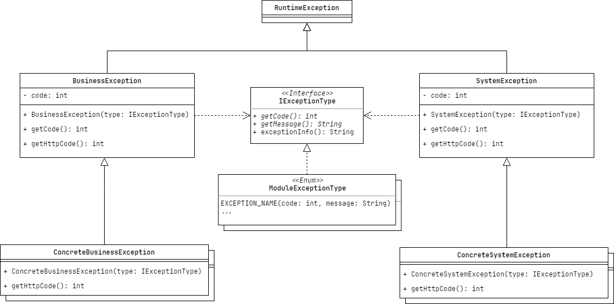
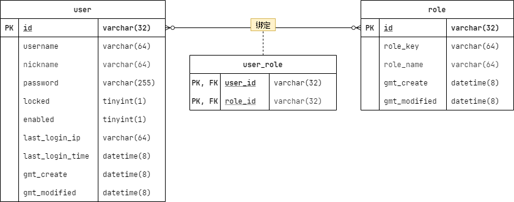

## 在线文章阅读系统 `V1.0`

|    时间    |  编辑人  |                文档说明                |
| :--------: | :------: | :------------------------------------: |
| 2023/04/18 | Hellovie | 系统设计、安全设计、异常设计和用户设计 |
|            |          |                                        |

### 系统设计

#### 模块设计

* 核心模块：包含系统数据传输架构和一些通用基类设计。

* 用户模块：用户信息管理。
* 异常模块：系统异常全局统一管理。
* 安全模块：权限控制。

#### 系统数据传输架构

数据类型分为：`Request`（前端请求参数）、`DTO`（穿梭在控制层、服务层的数据）、`VO`（响应给前端的数据）、`Entity`（实体数据）。通过不同数据类型的划分，提高数据隐蔽性和前端调用接口的便利性。

#### 分层说明

**控制层 `Controller`：** `api` 接口层，主要提供接口和数据校验。

**服务层 `Service`：**逻辑层，所有业务逻辑包含在这一层。

**持久层 `Dao`：**数据库操作层。

**Java Bean 转换层 `Mapper`：**提供 `Request`、`DTO`、`VO`、`Entity` 数据类型的转换。

 

### 安全设计

采用 `RBAC` 模型，实现用户、角色、权限的逻辑分离。

根据角色分配权限，通过将用户绑定不同角色来使得用户拥有不同权限。（一个用户可以绑定多个·角色，一个角色可以分配多种权限。）

 

### 异常设计

异常分为系统异常和业务异常。每个异常类绑定一个 `Http Code`，用于划分一类异常。具体的异常信息通过注入到异常类的枚举异常信息来确定。枚举异常信息包含状态码 `Code` 和异常信息 `Message`。枚举异常类按模块进行划分，不同模块可以定制自己的异常信息。

* 系统异常：交由开发者解决的异常。
* 业务异常：用户可以解决的异常。

 

### 用户设计

> 数据表必备三字段：`id`、`gmt_create`、`gmt_modified`。

用户表 `user` 只用来保存用户登录的必要字段，其他用户信息交由其他表储存。

#### 用户表 `user`

|     别名     |      字段名       |   数据类型    |       字段修饰符        |            备注            |
| :----------: | :---------------: | :-----------: | :---------------------: | :------------------------: |
|      ID      |       `id`        | `VARCHAR(32)` |      `PRIMARY KEY`      |                            |
|    用户名    |    `username`     | `VARCHAR(64)` |       `NOT NULL`        |          唯一索引          |
|     昵称     |    `nickname`     | `VARCHAR(64)` |       `NOT NULL`        |          用户昵称          |
|     密码     |    `password`     | `VARCHAR(64)` |       `NOT NULL`        |        加密后的密码        |
|     锁定     |     `locked`      | `TINYINT(1)`  | `DEFAULT 0`、`NOT NULL` | 是否锁定：1 - 是，0 - 否。 |
|     禁用     |     `enabled`     | `TINYINT(1)`  | `DEFAULT 1`、`NOT NULL` | 是否启用：1 - 是，0 - 否。 |
|  最后登录IP  |  `last_login_ip`  | `VARCHAR(64)` |         `NULL`          |                            |
| 最后登录时间 | `last_login_time` | `DATETIME(8)` |         `NULL`          |                            |
|   创建时间   |   `gmt_create`    | `DATETIME(8)` |       `NOT NULL`        |          GMT 时间          |
|   更新时间   |  `gmt_modified`   | `DATETIME(8)` |       `NOT NULL`        |          GMT 时间          |

#### 角色表 `role`

|   别名   |     字段名     |   数据类型    |  字段修饰符   |        备注        |
| :------: | :------------: | :-----------: | :-----------: | :----------------: |
|    ID    |      `id`      | `VARCHAR(32)` | `PRIMARY KEY` |                    |
| 角色标识 |   `role_key`   | `VARCHAR(64)` |  `NOT NULL`   |      唯一索引      |
| 角色昵称 |  `role_name`   | `VARCHAR(64)` |  `NOT NULL`   | 用于显示的角色昵称 |
| 创建时间 |  `gmt_create`  | `DATETIME(8)` |  `NOT NULL`   |      GMT 时间      |
| 更新时间 | `gmt_modified` | `DATETIME(8)` |  `NOT NULL`   |      GMT 时间      |

 