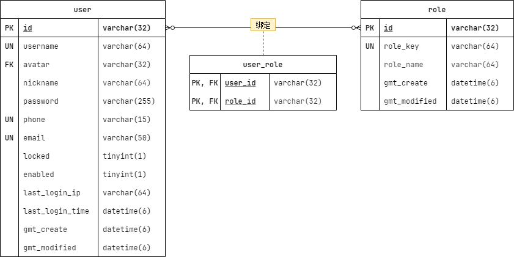

## 在线文章阅读系统 `V1.0`

|    时间    |  编辑人  |                        文档说明                        |
| :--------: | :------: | :----------------------------------------------------: |
| 2023/04/18 | Hellovie |         系统设计、安全设计、异常设计和用户设计         |
| 2023/04/19 | Hellovie |  异常设计添加统一响应前端格式、添加模块设计的包依赖图  |
| 2023/04/20 | Hellovie |     系统数据传输架构添加类图说明、修改用户角色ER图     |
| 2023/04/23 | Hellovie |                     添加用户角色表                     |
| 2023/05/05 | Hellovie |          添加数据格式校验规则、术语定义及说明          |
| 2023/05/05 | Hellovie | 用户账号添加“手机号码”、“邮箱”字段和设计第三方授权类图 |
|            |          |                                                        |

### 术语定义及说明

1. `Not Null`：数据不能为 `NULL`。
2. `Not Blank`：数据字符串不能为空字符串。
3. `Size(min = x, max = y)`：数据字符串长度在 x 到 y 之间，包含 x 和 y。
4. `Pattern(regexp = "rules")`：数据字符串满足 rules 中的正则表达式。
5. `Max(x)`：数值最大值不超过 x。
6. `Min(x)`：数值最小值不小于 x。
7. `Enum("a", "b", "c")`：数据字符串只能为“a”、“b”和“c”。

 

### 系统设计

#### 模块设计

* 核心模块：包含系统数据传输架构和一些通用基类设计。

* 用户模块：用户信息管理。
* 异常模块：系统异常全局统一管理。
* 安全模块：权限控制。

#### 包依赖图

#### 系统数据传输架构

数据类型分为：`Request`（前端请求参数）、`DTO`（穿梭在控制层、服务层的数据）、`VO`（响应给前端的数据）、`Entity`（实体数据）。通过不同数据类型的划分，提高数据隐蔽性和前端调用接口的便利性。

**类图说明：**

#### 分层说明

**控制层 `Controller`：** `api` 接口层，主要提供接口和数据校验。

**服务层 `Service`：** 逻辑层，所有业务逻辑包含在这一层。

**持久层 `Dao`：** 数据库操作层。

**Java Bean 转换层 `Mapper`：** 提供 `Request`、`DTO`、`VO`、`Entity` 数据类型的转换。

 

### 安全设计

采用 `RBAC` 模型，实现用户、角色、权限的逻辑分离。

根据角色分配权限，通过将用户绑定不同角色来使得用户拥有不同权限。（一个用户可以绑定多个·角色，一个角色可以分配多种权限。）

#### 数据格式校验规则

##### 用户 ID

* `Not Blank`：用户ID不能为空！

##### 用户名

* `Not Blank`：用户名不能为空！
* `Size(min = 8, max = 16)`：用户名长度应该在8到16之间！
* `Pattern(regexp = "^[a-zA-Z]{1}\w*$")`：用户名必须以字母开头，只包含字母、数字和下划线！

##### 密码

* `Not Blank`：密码不能为空！
* `Size(min = 8, max = 16)`：密码长度应该在8到16之间！
* `Pattern(regexp = "^(?![a-zA-Z]+$)(?!\d+$)(?![^\da-zA-Z\s]+$).*$")`：密码必须由字母、数字和特殊字符中的任意2种组成！

##### 用户状态

* `Enum("LOCK", "UNLOCK", "ENABLE", "DISABLE")`：无效的用户状态！

##### 手机号码

* `Not Blank`：手机号码不能为空！
* `Pattern(regexp = "/^1(3\d|4[5-9]|5[0-35-9]|6[567]|7[0-8]|8\d|9[0-35-9])\d{8}$/")`：无效的手机号码！

##### 邮箱

* `Not Blank`：邮箱地址不能为空！
* `Pattern(regexp = "^[a-zA-Z0-9_-]+@[a-zA-Z0-9_-]+(\.[a-zA-Z0-9_-]+)+$")`：无效的邮箱地址！

 

### 异常设计

异常分为系统异常和业务异常。每个异常类绑定一个 `Http Code`，用于划分一类异常。具体的异常信息通过注入到异常类的枚举异常信息来确定。枚举异常信息包含状态码 `Code` 和异常信息 `Message`。枚举异常类按模块进行划分，不同模块可以定制自己的异常信息。

* 系统异常：交由开发者解决的异常。
* 业务异常：用户可以解决的异常。

#### 统一响应前端格式

统一返回给前端“响应数据”、“响应描述”、“响应状态码”、“接口调用时间”。

* 调用成功：返回统一的“成功响应状态码”、统一的“成功响应描述”、“接口调用时间”和前端请求的相应“响应数据”。
* 调用失败：不返回“响应数据”、返回相应的“异常响应状态码”、相应的“异常响应描述”、“接口调用时间”。

 

### 用户设计

> 数据表必备三字段：`id`、`gmt_create`、`gmt_modified`。

用户表 `user` 只用来保存用户登录的必要字段，其他用户信息交由其他表储存。

#### 用户表 `user`

|     别名     |      字段名       |    数据类型    |       字段修饰符        |            备注            |
| :----------: | :---------------: | :------------: | :---------------------: | :------------------------: |
|      ID      |       `id`        | `VARCHAR(32)`  |      `PRIMARY KEY`      |                            |
|    用户名    |    `username`     | `VARCHAR(64)`  |       `NOT NULL`        |          唯一索引          |
|     昵称     |    `nickname`     | `VARCHAR(64)`  |       `NOT NULL`        |          用户昵称          |
|     密码     |    `password`     | `VARCHAR(255)` |       `NOT NULL`        |        加密后的密码        |
|   手机号码   |      `phone`      | `VARCHAR(15)`  |         `NULL`          |     手机和邮箱必填其一     |
|   邮箱地址   |      `email`      | `VARCHAR(50)`  |         `NULL`          |     手机和邮箱必填其一     |
|     锁定     |     `locked`      |  `TINYINT(1)`  | `DEFAULT 0`、`NOT NULL` | 是否锁定：1 - 是，0 - 否。 |
|     禁用     |     `enabled`     |  `TINYINT(1)`  | `DEFAULT 1`、`NOT NULL` | 是否启用：1 - 是，0 - 否。 |
|  最后登录IP  |  `last_login_ip`  | `VARCHAR(64)`  |         `NULL`          |                            |
| 最后登录时间 | `last_login_time` | `DATETIME(8)`  |         `NULL`          |                            |
|   创建时间   |   `gmt_create`    | `DATETIME(8)`  |       `NOT NULL`        |          GMT 时间          |
|   更新时间   |  `gmt_modified`   | `DATETIME(8)`  |       `NOT NULL`        |          GMT 时间          |

#### 角色表 `role`

|   别名   |     字段名     |   数据类型    |  字段修饰符   |        备注        |
| :------: | :------------: | :-----------: | :-----------: | :----------------: |
|    ID    |      `id`      | `VARCHAR(32)` | `PRIMARY KEY` |                    |
| 角色标识 |   `role_key`   | `VARCHAR(64)` |  `NOT NULL`   |      唯一索引      |
| 角色昵称 |  `role_name`   | `VARCHAR(64)` |  `NOT NULL`   | 用于显示的角色昵称 |
| 创建时间 |  `gmt_create`  | `DATETIME(8)` |  `NOT NULL`   |      GMT 时间      |
| 更新时间 | `gmt_modified` | `DATETIME(8)` |  `NOT NULL`   |      GMT 时间      |

#### 用户角色表

|  Role Key(唯一)  | Role Name  |                      说明                      |
| :--------------: | :--------: | :--------------------------------------------: |
|    ROLE_USER     |  普通用户  |               注册即成为普通用户               |
|    ROLE_ADMIN    | 普通管理员 | 具有少数权限，操作安全，不影响数据库和用户体验 |
| ROLE_SUPER_ADMIN | 超级管理员 |                  具有所有权限                  |

 

### 第三方授权登录注册

第三方授权登录注册包括微信、微博...。

在本系统中，手机号注册和邮箱注册也归属到第三方授权登录注册。虽然它们的值保存在 `user` 表里，但是它们都是系统自动生成的用户名，所以归属到第三方授权登录注册。

#### 类图设计

 